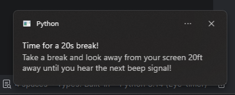
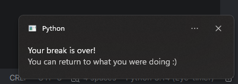

# Eye Break Timer

---

Eye timer is a lightweight Python script, which beeps every X minutes you set in the variable to remind you to take a break for your screen

`timerduration = 20*60` This will beep every **20** minutes

---
## Requirements

```
plyer
time
winsound
```

---

## How notifications look like:

****



---

## How to run the project:

1. Clone the repository:
`git clone https://github.com/Sigis5/Eye-break-timer.git`
2. Open the folder `Eye-break-timer`
3. Install the python requirements:
```
pip install plyer
pip install winsound
pip install time
```
4. Run the script: `python EYE_timer_2.0.py`
5. Enjoy

---

## License:

This project is licensed under MIT license. See the LICENSE file for more info.
